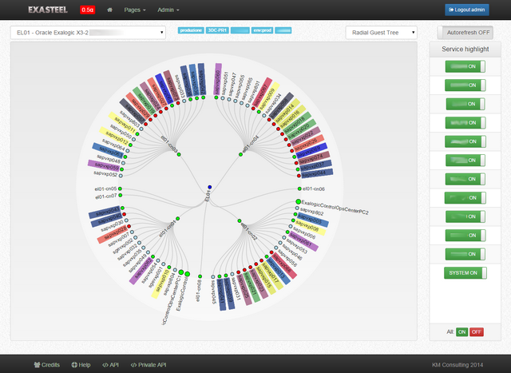
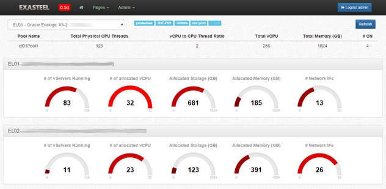

# Exasteel

This started as a Mojolicious boilerplate, then turned into a Mojolicious demo app then as a utility to visualize some KPI of an Exalogic infrastructure using D3.

Current status: **work in progess**

## Prerequisites

- [Mojolicious](http://mojolicio.us/) developed on latest... (6.11 right now)
    - Mojolicious::Plugin::Config
- [Bootstrap](http://getbootstrap.com/) (3.3.1)
- [Font Awesome](http://fortawesome.github.io/Font-Awesome/) (4.2.0)

- Javascript libraries:
    - [jquery (>=2.0.3)](http://jquery.com) (2.1.1)
    - [D3](http://d3js.org/) (3.4.13)
      - [d3-tip](http://labratrevenge.com/d3-tip) (0.6.6)
    - [DateTime Picker](http://www.malot.fr/bootstrap-datetimepicker/) (2.3.1)
    - [intro.js](http://usablica.github.io/intro.js/) v0.9.0
    - [Bootstrap Toggle](http://www.bootstraptoggle.com/) v2.2.0

- Additional Perl modules (optional)
    - IO:Socket (1.36)
    - MIME::Lite (3.030)
    - EV (4.18)

- Other software needed
    - `pod2html` to generate API docs from source (see `script/generate_api_docs.sh`)
    - `git-cache-meta` to handle permission in a git repo

## Database

See `script/dbinit.js` for a (very) basic model/collections description. Create a new database and its collections in mongo by giving this command (I suppose that you have a running mongod):

    mongo < scripts/dbinit.js

# How to start

You need a few things:

* a recent Perl installation (let's say >=5.18.4), if you are not an admin on your computer I suggest `perlbrew` to create your own Perl (+modules) local installation; in this case you need quite a lot of space in your home dir (let's say a few hundreds MB)
* then fire up `cpan` to install the required modules in a breeze:

    cpan Mojolicious Mojolicious::Plugin::I18N Mojolicious::Plugin::RenderFile MongoDB DateTime Digest::MD5

After a while you should have everything to try to start the app... In the cloned directory type:

    morbo -v script/exasteel

Which starts the development server for a Mojolicious app, it should respond with (the port can vary, see `exasteel.conf` file):

    Server available at http://127.0.0.1:3000.

Open your browser and... well, you know (probably you'll want to take a look at `script/dbinit.js` for the login credentials :).

# TODO

A lot!

# Screenshots

## Versioning

Releases will be numbered with the follow format:

`<major>.<minor>.<patch>`

And constructed with the following guidelines:

* Breaking backwards compatibility bumps the major
* New additions without breaking backwards compatibility bumps the minor
* Bug fixes and misc changes bump the patch

For more information on semantic versioning, please visit http://semver.org/.
